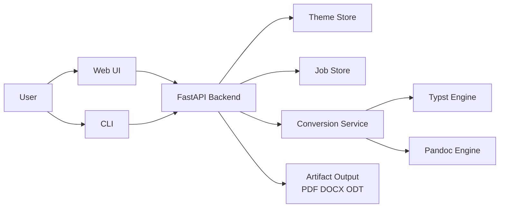
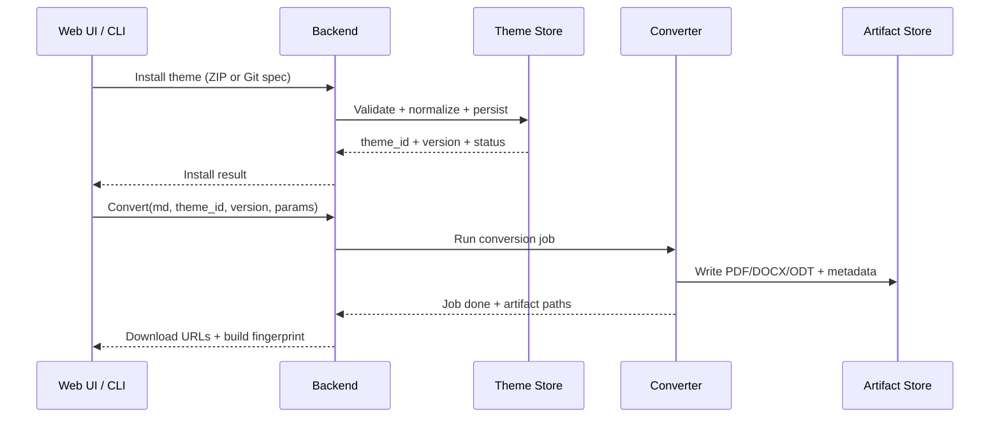

# Design System — Typst Document Converter

Generated by `/design-consultation` · April 2026

---

## Product Context

- **What this is:** A web-based Markdown → Typst document converter that generates beautifully typeset PDF, DOCX, and ODT output through curated theme templates.
- **Who it's for:** Developers, researchers, students, and professionals who want print-quality documents from plain Markdown — without manual layout work.
- **Space/industry:** Document generation / developer productivity / design tooling
- **Project type:** Web app (single-page, step-based conversion flow)
- **Strategic direction:** Selective Expansion (CEO Review Option A) — scenario-driven theme selection + optional theme package upload

---

## Aesthetic Direction

- **Direction:** Editorial / Refined Studio
- **Decoration level:** Intentional — warm surface tones, no gradients, clean editorial spacing, subtle depth via borders and shadows only
- **Mood:** A quiet, confident document studio. The UI itself should signal that it cares about design. Not a utility form, not a flashy marketing site. Something a typographer would trust.
- **Safe choices:**
  1. `#E94845` as the single accent — continuity with the Bubble template brand users already know
  2. Card-based step layout — familiar and scannable for a multi-step conversion flow
  3. Step progress indicator — reduces "am I lost?" anxiety in sequential flows
- **Risks taken:**
  1. **Fraunces serif for display headings** — editorial serif in a dev-adjacent tool is unusual, but earns immediate credibility: "a tool that cares about typography uses a typographically beautiful font."
  2. **Warm ivory background `#F8F7F4`** — breaks from the cold `#f5f6fa` SaaS homogeneity. Signals a premium, print-informed aesthetic. Every competitor uses cold white/gray.
  3. **Document Theater result state** — when the PDF is generated, the result area switches to a dark ink surface (`#1C1917`). The white PDF glows against it, transforming "file download" into a genuine delivery moment.

---

## Typography

- **Display / Hero:** **Fraunces** (variable optical-size serif, Google Fonts)
  - Roles: H1, H2, card titles, hero headings, brand name
  - Rationale: Editorial gravitas. A document tool whose own UI uses a beautiful serif earns meta-credibility. Use `font-variation-settings: "opsz" [size]` to match optical size to rendered size.
- **Body / UI:** **Plus Jakarta Sans** (humanist geometric, Google Fonts)
  - Roles: body text, labels, form inputs, buttons, hints, captions, step labels
  - Rationale: Modern and humanist without being overused (unlike Inter/Poppins/Roboto). Reads cleanly at 12–16px. Weights: 400, 500 (medium), 600 (semibold), 700 (bold).
- **Code:** **JetBrains Mono** (Google Fonts)
  - Roles: inline code, code blocks, hex value displays, mono data
- **Loading:** Google Fonts CDN via `<link>` preconnect
  ```html
  <link rel="preconnect" href="https://fonts.googleapis.com">
  <link rel="preconnect" href="https://fonts.gstatic.com" crossorigin>
  <link href="https://fonts.googleapis.com/css2?family=Fraunces:ital,opsz,wght@0,9..144,300..900;1,9..144,300..900&family=Plus+Jakarta+Sans:wght@300;400;500;600;700&family=JetBrains+Mono:wght@400;500&display=swap" rel="stylesheet">
  ```
- **Scale:**

  | Level | Font | Size | Weight | Use |
  |-------|------|------|--------|-----|
  | H1 | Fraunces | 2.25rem | 700 | Document title, page title |
  | H2 | Fraunces | 1.75rem | 600 | Section heading |
  | H3 | Plus Jakarta Sans | 1.2rem | 700 | Sub-section |
  | Body | Plus Jakarta Sans | 1rem | 400 | Paragraphs, descriptions |
  | UI Label | Plus Jakarta Sans | 0.875rem | 500–600 | Form labels, nav items |
  | Small | Plus Jakarta Sans | 0.85rem | 400 | Hints, captions |
  | Micro label | Plus Jakarta Sans | 0.7rem | 700 | Step labels, badges (uppercase + letter-spacing) |
  | Code | JetBrains Mono | 0.9rem | 400 | Code, hex values |

---

## Color

- **Approach:** Restrained-plus — one accent color, warm neutrals throughout. Color earns meaning because it is rare.

| Token | Value | Usage |
|-------|-------|-------|
| `--c-primary` | `#E94845` | CTAs, active states, accent, step indicators |
| `--c-primary-hover` | `#D63A37` | Button hover state |
| `--c-primary-bg` | `#FEF2F2` | Selected card backgrounds, alert tints |
| `--c-bg` | `#F8F7F4` | Page background (warm ivory) |
| `--c-surface` | `#FFFFFF` | Card / panel surface |
| `--c-theater` | `#1C1917` | Document Theater result bg, app header |
| `--c-text` | `#1C1917` | Primary body text |
| `--c-text-secondary` | `#78716C` | Muted text, hints, placeholders |
| `--c-text-inverse` | `#F8F7F4` | Text on dark surfaces |
| `--c-border` | `#E7E5E4` | Card borders, input borders |
| `--c-border-strong` | `#D6D3D1` | Dividers, focused inputs |
| `--c-success` | `#16A34A` | Success states |
| `--c-warning` | `#D97706` | Warning states |
| `--c-error` | `#E94845` | Error states (same as primary) |
| `--c-info` | `#2563EB` | Info states |

- **Download buttons:** Unified to ghost/outline style. Only the primary PDF download uses `--c-primary` fill. DOCX and ODT use neutral ghost buttons — eliminates the jarring red/blue/green tricolor clash.

- **Dark mode strategy:** `data-dark="true"` on `<html>`. Shift surfaces: bg `#292524`, surface `#1C1917`, text `#F5F5F4`, secondary `#A8A29E`, borders `#3F3733 / #57534E`. Reduce primary saturation slightly if needed. Theater result bg stays the same (both light and dark modes look correct against `#1C1917`).

---

## Spacing

- **Base unit:** 8px
- **Density:** Comfortable (not dashboard-cramped, not marketing-airy)
- **Scale:**

  | Token | Value | Use |
  |-------|-------|-----|
  | `--sp-1` | 0.25rem / 4px | Icon gaps, micro spacing |
  | `--sp-2` | 0.5rem / 8px | Inline gaps, badge padding |
  | `--sp-3` | 0.75rem / 12px | Button padding vertical, form hint gap |
  | `--sp-4` | 1rem / 16px | Form group gap, component inner padding |
  | `--sp-5` | 1.25rem / 20px | Card inner header gap |
  | `--sp-6` | 1.5rem / 24px | Card padding, section horizontal |
  | `--sp-8` | 2rem / 32px | Section body padding, large gaps |
  | `--sp-10` | 2.5rem / 40px | Post-desc margin before content |
  | `--sp-12` | 3rem / 48px | Section footer spacing |
  | `--sp-16` | 4rem / 64px | Full section vertical padding |

---

## Layout

- **Approach:** Grid-disciplined — strict column layout, predictable alignment
- **Main container:** `max-width: 960px; margin: 0 auto; padding: 0 1.5rem`
- **Step grid:** Single-column stacked cards — each step is a card, scrolled vertically, with the step indicator at top
- **Template picker:** `grid-template-columns: repeat(auto-fill, minmax(200px, 1fr))` — responsive
- **Form grid:** 2 columns (`1fr 1fr`), collapses to 1 column at `< 600px`
- **Border radius:**
  - `--r-sm: 4px` — badges, tags, small elements
  - `--r-md: 8px` — inputs, buttons, small cards
  - `--r-lg: 12px` — main cards
  - `--r-xl: 16px` — product mockup frame, theater result container
  - `--r-full: 9999px` — chips, toggle button
- **Max content width:** 960px
- **Elevation:**
  - `--shadow-sm`: subtle (hover states, nav)
  - `--shadow-md`: card default
  - `--shadow-lg`: PDF preview in theater mode (dramatic, 24px y-offset)

---

## Motion

- **Approach:** Intentional — transitions that aid comprehension. No purely decorative animation.
- **Easing:** enter `ease-out` · exit `ease-in` · move `ease-in-out`
- **Duration reference:**

  | Interaction | Duration | Notes |
  |-------------|----------|-------|
  | Button hover lift | 150ms ease-out | `translateY(-1px) + box-shadow` |
  | Card hover lift | 250ms ease-out | `translateY(-3px) + shadow` |
  | Input focus ring | 150ms ease | border-color + box-shadow |
  | Step card transition | 300ms ease-in-out | Fade + 20px slide |
  | PDF Theater fade-in | 400ms ease-out | Opacity 0→1 + slight scale |
  | Loading spinner | 0.8s linear | CSS `animation: spin` |
  | Color/border transitions | 200ms | Default `transition: all 0.2s` |

---

## Key UI Patterns

### Step Flow
Each step is a `<div class="card">` with a `step-label` (uppercase, red) and `section-title` (Fraunces). The step indicator (`steps-nav`) uses dots: inactive = `--c-border`, active = `--c-primary` at `scale(1.3)`, done = `--c-success`.

### Template / Scenario Picker
Two-layer selection:
1. **Scenario chips** (Academic / Business / Portfolio / Technical / Custom) — filters the theme grid
2. **Theme cards** — thumbnail preview image, name, badge (Built-in / Uploaded / Scenario)

New in V2: theme cards show a small thumbnail mockup, not just text. Selected state: `border-color: --c-primary; background: --c-primary-bg`.

### Document Theater (Result State)
When conversion completes:
- Wrap result area in a `#1C1917` container with `border-radius: --r-xl`
- PDF iframe becomes prominent (`box-shadow: 0 24px 64px rgba(0,0,0,0.5)`)
- Download actions row: primary PDF button in red, others ghost/outline
- Step label: "Your document is *ready*" (Fraunces italic for "ready")

### Theme Upload Zone
- Standard dashed border upload zone, but with a 📦 icon and explicit guidance: "must contain `template.typ` + `meta.json`"
- On hover: `border-color: --c-primary; background: --c-primary-bg`
- After upload: shows filename with `--c-primary` color + validate/install button

---

## Decisions Log

| Date | Decision | Rationale |
|------|----------|-----------|
| 2026-04-01 | Initial design system created | `/design-consultation` — Editorial/Refined Studio direction chosen |
| 2026-04-01 | Fraunces as display font | Editorial serif earns meta-credibility for a document tool |
| 2026-04-01 | Warm ivory `#F8F7F4` background | Differentiates from cold SaaS gray; signals print studio aesthetic |
| 2026-04-01 | Document Theater result state | Transforms file download into a document delivery moment |
| 2026-04-01 | Unified ghost download buttons | Eliminates jarring red/blue/green tricolor; only primary PDF action gets fill |
| 2026-04-01 | Plus Jakarta Sans for UI | Modern, humanist, not overused; replaces Segoe UI / system-ui |

---

## GSTACK REVIEW REPORT

| Review | Trigger | Why | Runs | Status | Findings |
|--------|---------|-----|------|--------|----------|
| CEO Review | `/plan-ceo-review` | Scope & strategy | 1 | ✓ Done | Selective Expansion (Option A) recommended |
| Design Consultation | `/design-consultation` | Visual system | 1 | ✓ Done | Editorial/Refined Studio direction, Fraunces + Plus Jakarta Sans |
| Eng Review | `/plan-eng-review` | Architecture & tests (required) | 0 | — | — |
| Codex Review | `/codex review` | Independent 2nd opinion | 0 | — | — |

**VERDICT:** Design system locked — proceed to `/plan-eng-review` to finalize API architecture for theme upload feature (Option A implementation).

---

## Plan Eng Review (Option A) — Deepened Execution Plan

### Scope Lock

- Goal: turn the current converter into a multi-theme platform with two install channels:
  1. Upload theme ZIP from web
  2. Install theme from Git/Typst package spec via CLI
- Non-goal for this phase: public marketplace, auth, billing, moderation, multi-tenant quotas.

### System Architecture



Design decision:

- Keep a single backend as orchestrator.
- Unify ZIP and CLI installs into the same Theme Store contract.

### Theme Store Contract

Each installed theme is persisted under a deterministic structure:

- `themes/<theme_id>/<version>/...`
- `themes/<theme_id>/<version>/meta.json`
- `themes/<theme_id>/<version>/wrapper.typ.jinja`
- `themes/<theme_id>/<version>/template.typ`

Required metadata fields:

- `theme_id`
- `version`
- `source_type` (`built_in|zip|git|preview`)
- `source_ref` (git URL + ref, or package spec)
- `installed_at`
- `compat.typst_min`

### Conversion Build Fingerprint

Every conversion run writes and returns:

- `build_id`
- `theme_id`
- `theme_version`
- `converter_version`
- `typst_version`
- `pandoc_version`
- `created_at`

This is mandatory for reproducibility.

### End-to-End Data Flow



### State Machines

Theme install state:

- `pending` -> `validating` -> `installed`
- `pending` -> `validating` -> `failed`

Conversion job state:

- `queued` -> `running` -> `succeeded`
- `queued` -> `running` -> `partial_failed`
- `queued` -> `running` -> `failed`

Rule:

- `partial_failed` is allowed only when one or two target formats fail while at least one output succeeds.

### API Surface (Phase A)

Install and theme APIs:

- `POST /api/theme/upload` (already present, keep)
- `POST /api/theme/install` (new, accepts package spec or git payload)
- `GET /api/themes`
- `GET /api/themes/{theme_id}/versions`

Conversion APIs:

- `POST /api/convert` (extend to accept explicit `theme_version`)
- `GET /api/builds/{build_id}`

### CLI Surface (Phase A)

- `cli.py init <package_spec> [--output-dir ...]` (already implemented)
- add `cli.py install-git <repo> --ref <tag|sha>`
- add `cli.py list --verbose` to show source, version, compatibility.

### Failure Handling Policy

- Installation failures must return actionable errors:
  - invalid archive structure
  - unsupported typst version
  - missing required files
  - git fetch or ref resolution failure
- Conversion failures return:
  - format-level status (`pdf|docx|odt`)
  - remediation hint
  - build logs reference id

### Security Boundaries

- ZIP extraction:
  - block absolute paths and `..`
  - file count and size limits
- Git install:
  - block local-path and file protocol
  - enforce allowlist or explicit opt-in for unknown hosts
- Template execution:
  - no shell execution from template content
  - engine invocation remains argument-list only (no shell mode)

### Test Plan (Required Before Merge)

Unit tests:

- metadata validation
- theme version resolver
- build fingerprint generation

Integration tests:

- install ZIP -> list themes -> convert with selected version
- install Git package -> list versions -> convert
- one-format failure produces `partial_failed`

Regression tests:

- existing Bubble path unaffected
- session cleanup still works with installed versioned themes

### Performance and Reliability Budgets

- Theme install P95 under 3s for local ZIP under 5MB
- Conversion P95 under 12s for medium markdown files
- API error rate under 1% excluding invalid user input

### Rollout Plan

1. Phase A1:
   - theme version model
   - API contract update
   - backward compatibility shim
2. Phase A2:
   - CLI git install command
   - build metadata surfaces in UI
3. Phase A3:
   - hardening + full tests + docs refresh

### Engineering Verdict

Status: DONE_WITH_CONCERNS

Cleared to implement Option A with the above constraints.
Primary concern: current environment Typst version compatibility can block newer package specs. Enforce preflight checks and fail-fast error messaging before writing to Theme Store.
